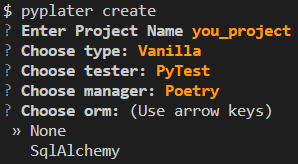
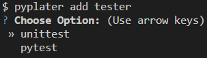

<div style="display: flex; justify-content: center; align-items: center; gap: 1rem;">

</div>

**_in development_**

<!-- for reference when published -->
<!-- <p align="center">
<a href="https://github.com/tiangolo/fastapi/actions?query=workflow%3ATest+event%3Apush+branch%3Amaster" target="_blank">
    
</a>
<a href="https://coverage-badge.samuelcolvin.workers.dev/redirect/tiangolo/fastapi" target="_blank">
    
</a>
<a href="https://pypi.org/project/fastapi" target="_blank">
    
</a>
<a href="https://pypi.org/project/fastapi" target="_blank">
    
</a>
</p> -->

PyPlater is a Python CLI Tool to generate, build, and create boilerplate code for python projects Including linting, formatting, unit testing, and package managing from prebuilt and your own custom templates

# Project Options

|    Templates     |     Testing      | Package Managers |    ORMs    |
| :--------------: | :--------------: | :--------------: | :--------: |
| Vanilla, FastAPI | Unittest, PyTest |   PIP, Poetry    | SqlAlchemy |

# Get Setup

### Install PyPlater

```
$ pip install pyplater
```

# Commands

## PyPlater Create



### Options

- --name: Project Name
- --type: Project Template
- --tester: Unit Testing Library
- --manager: Package Manager
- --orm: Database ORM Library

## Examples

### Create Vanilla Project

```
$ pyplater create --name your_project --type vanilla --tester unittest --manager pip --orm none
```

### File Structure

```
your_project/
    ├── your_project/
        ├── test/
            ├── __init__.py
            └── test.py
        ├── __init__.py
        ├── config.py
        └── main.py
    ├── .env.example
    ├── .flake8
    ├── .gitignore
    ├── pyproject.toml
    ├── requirements.txt
    ├── requirements.dev.txt
    └── README.md
```

### Create FastAPI Project

```
$ pyplater create --name your_project --type fastapi --tester pytest --manager poetry --orm sqlalchemy
```

### File Structure

```
your_project/
    ├── app/
        ├── router/
            ├── auth.py
            ├── post.py
        ├── db/
            ├── database.py
            ├── shcema.py
            ├── crud.py
            └── model.py
        ├── test/
            ├── __init__.py
            └── test.py
        ├── __init__.py
        ├── config.py
        └── main.py
    ├── .env.example
    ├── .flake8
    ├── .gitignore
    ├── pyproject.toml
    └── README.md
```

## PyPlater Add

Add subdirectory file structture to the cwd using pyplater



### Options

- [CONTENT]: [tester, manager, orm]
- --option: Library for the chosen content

## PyPlater Run

Define commands in the pyproject.toml to run your custom scripts with pyplater

```
$ pyplater run install
$ pyplater run script
```

## pyproject.toml

```
[pyplater.scripts]
script = "poetry run python ./script/main.py"
install = "poetry install"
```

## Default Library Configuration

- **_Linting:_** Flake8
- **_Formatting:_** Black
- **_Enviroment:_** Settings config w/ pydantic
